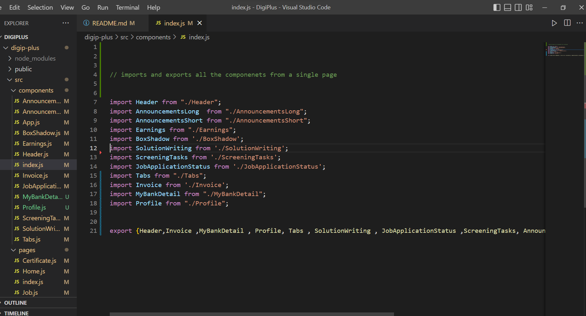

## How to use this App

hosted on vercel https://digip-plus.vercel.app/

This is a single-page react application
Used React router dom v6 for the navigation between pages
and used the nested routes for navigation between different tabs of the same pages

## Components

I have created multiple reusable components to reduce the code 

 

1) Announcement container= it will return the data that is passed to it
2) Earnings, BoxShadow container will display the data that is passed to it with the required sentences
3)Tabs component that the path of the particular tab and title and this tab is used for page navigation 

## State Management

1) used react hooks  for toggle functionality 
2) the need for a separate state is eliminated by the NavLnk from react-router dom v6 

## styles
1) used  CSS tried to create the provide design reference

# Getting Started with Create React App

This project was bootstrapped with [Create React App](https://github.com/facebook/create-react-app).

## Available Scripts

In the project directory, you can run:

### `npm start`

Runs the app in the development mode.\
Open [http://localhost:3000](http://localhost:3000) to view it in your browser.

The page will reload when you make changes.\
You may also see any lint errors in the console.
